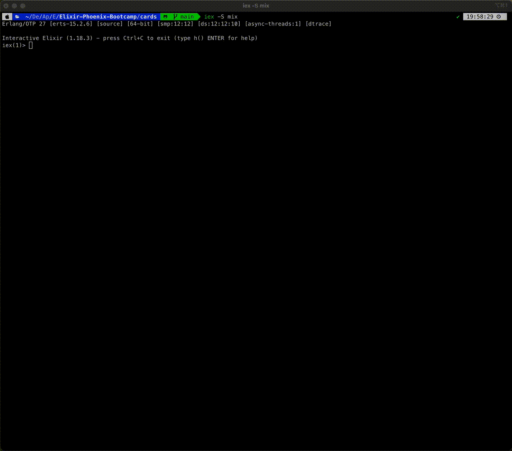

# Elixir-Phoenix Projects

## Deck of Cards

`create_deck`

Creates and returns a full array of playing cards.

Used to initialize a new deck.

`shuffle`

Randomizes the order of a deck of playing cards.

Accepts an array of cards and returns a shuffled version.

`deal`

Creates a hand of cards from the deck.

Removes and returns a subset of cards from the deck.

`contains?`

Checks whether a specific card exists in a given deck.

Accepts a deck and a single card, returns true or false.

`save`

Saves a collection of cards to a file on the local machine.

Used for persistence between sessions.

`load`

Loads a collection of cards from the local machine.

Restores a previously saved deck or hand.

### Demo

## Identicons

`hash_input`

Compute MD5 hash of string.

List of number based on the string.

`pick_color`

First three elements of hash list represent the RBG values for identicon.

`build_grid`

Returns an array of subarrays, where each subarray represents a single row of the grid.

pass in collection and function that is called with every elelment in the list.

`mirror_row`

Mirror an individual row.

`filter_odd_squares`

Filtering process for determing which square should have color.

if the number odd remove from the record, if even it will have color.

`build_pixel_map`

convert grid indices into 50×50 rectangle coordinates and stores it in the image struct.

`draw_image`

Creates a 250×250 image by drawing colored rectangles from the pixel map and rendering it to binary image .

`save_image`

Writes the generated image binary to a PNG file named after the input.

### Demo

## Discuss

Users can sign in and post a topic for discussion

| Functionality                            | Routes                | Controller Function |
| ---------------------------------------- | --------------------- | ------------------- |
| See the form to create a new topic       | GET `/topics/new`     | `new`               |
| Submit the form to create a topic        | POST `/topics`        | `create`            |
| Get a list of all topics                 | GET `/topics`         | `index`             |
| Delete a topic with ID                   | DELETE `/topics/id`   | `delete`            |
| See the form to update an existing topic | GET `/topics/id/edit` | `edit`              |
| Submit the form to update a topic        | PUT `/topics/id`      | `update`            |

### Demo

## Authentication

## Transforming Requests with Plugs

## Websockets in Phoenix
