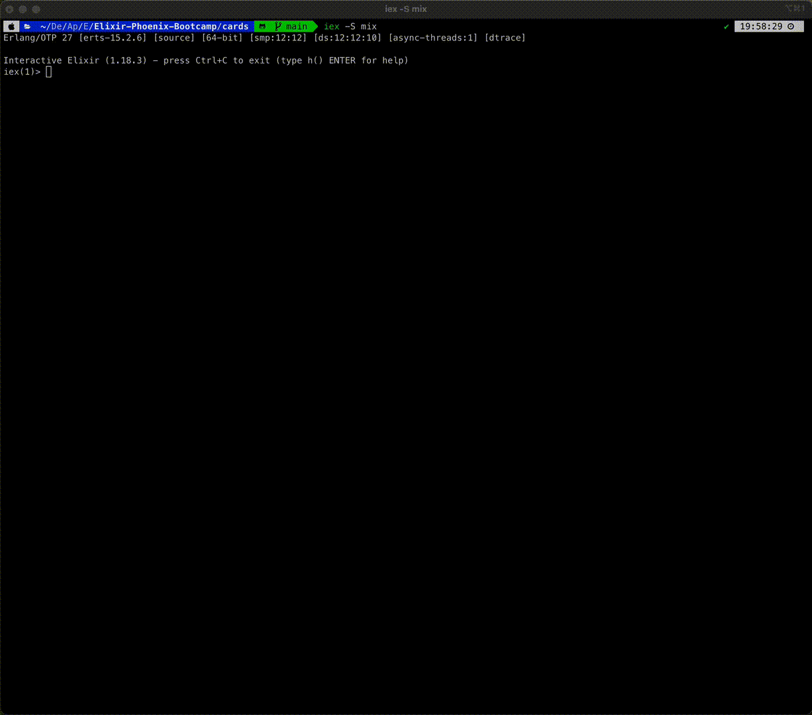
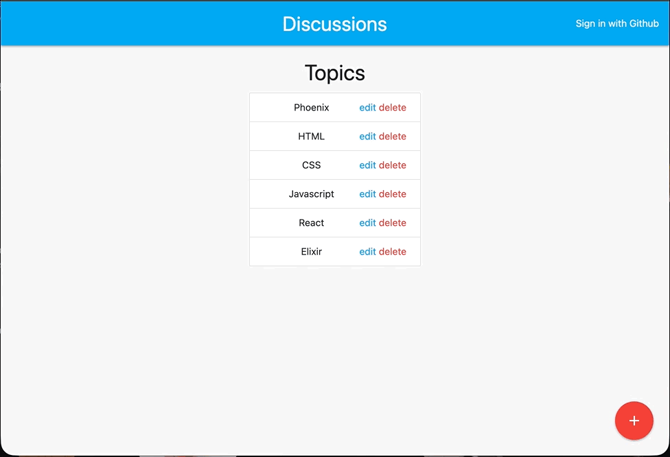
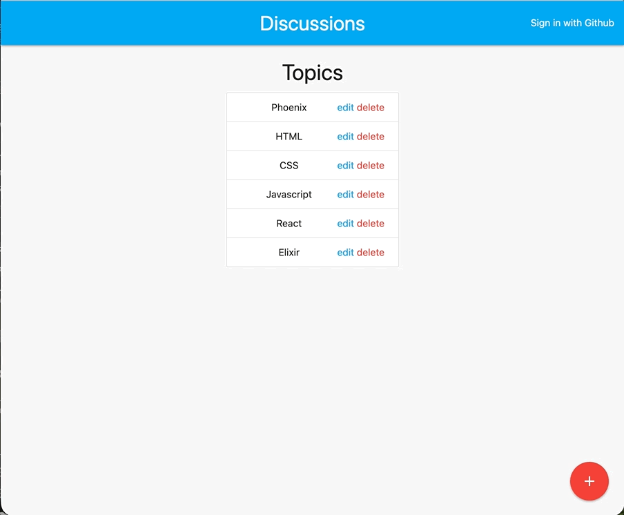
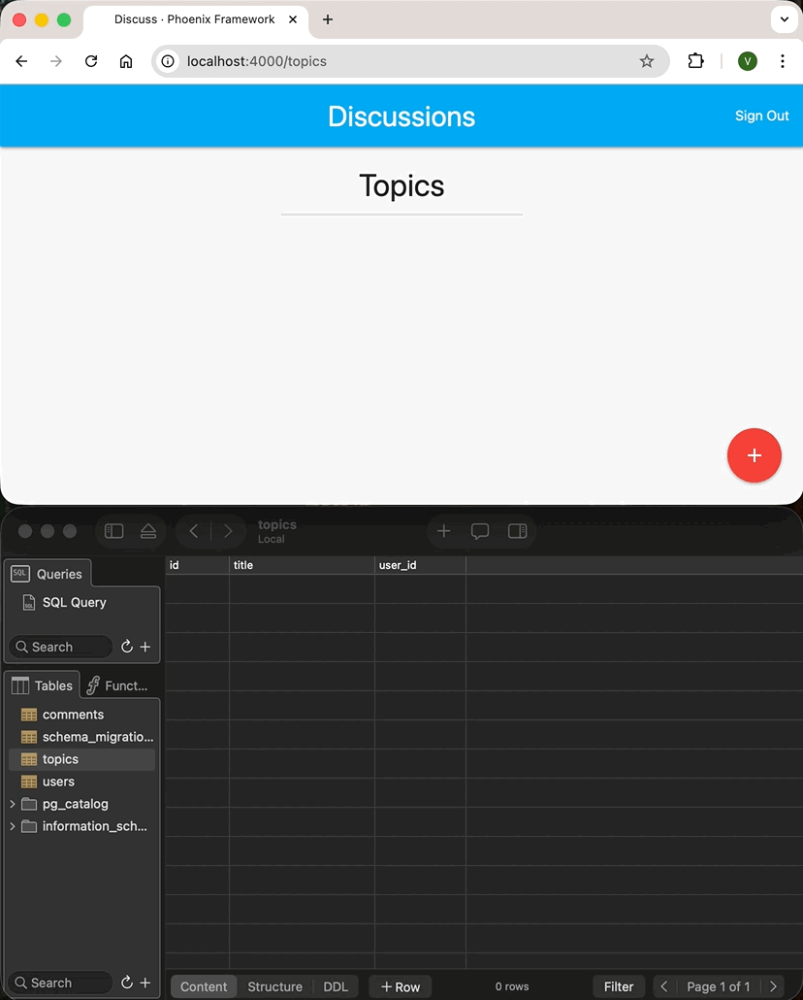
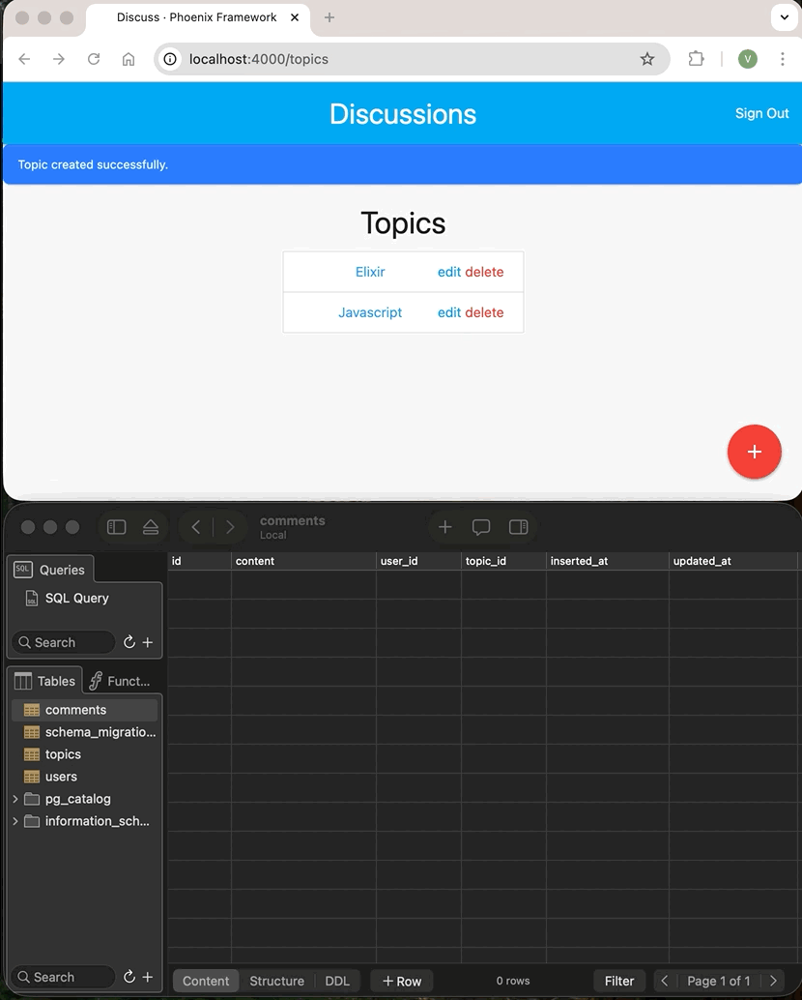

# Elixir Phoenix Bootcamp Projects

Code and projects built while working through [_The Complete Elixir and Phoenix Bootcamp_](https://www.udemy.com/course/the-complete-elixir-and-phoenix-bootcamp-and-tutorial/).

This repository contains multiple applications that demonstrate core Elixir and Phoenix concepts, including functional programming, database interactions with Ecto, authentication, and real-time features using WebSockets.

The original course material was built on older Phoenix versions. This repository has been updated to use modern Phoenix conventions, including:

- HEEx templates
- Verified routes (`~p`)
- Component-based layouts
- Updated plug and router patterns

## Cards App

A simple Elixir module for working with a deck of cards.

**Concepts:**

- Lists & pattern matching
- Enum module
- File I/O
- Functional composition

**Functionality:**

`create_deck`

Creates and returns a full array of playing cards.

Used to initialize a new deck.

`shuffle`

Randomizes the order of a deck of playing cards.

Accepts an array of cards and returns a shuffled version.

`deal`

Creates a hand of cards from the deck.

Removes and returns a subset of cards from the deck.

`contains?`

Checks whether a specific card exists in a given deck.

Accepts a deck and a single card, returns true or false.

`save`

Saves a collection of cards to a file on the local machine.

Used for persistence between sessions.

`load`

Loads a collection of cards from the local machine.

Restores a previously saved deck or hand.

### Demo



## Identicons App

Generates a GitHub-style identicon from a string input.

**Concepts:**

- Structs
- Binary pattern matching
- Image generation pipeline
- Hashing

**Functionality:**

`hash_input`

Compute MD5 hash of string.

List of number based on the string.

`pick_color`

First three elements of hash list represent the RBG values for identicon.

`build_grid`

Returns an array of subarrays, where each subarray represents a single row of the grid.

pass in collection and function that is called with every elelment in the list.

`mirror_row`

Mirror an individual row.

`filter_odd_squares`

Filtering process for determing which square should have color.

if the number odd remove from the record, if even it will have color.

`build_pixel_map`

convert grid indices into 50×50 rectangle coordinates and stores it in the image struct.

`draw_image`

Creates a 250×250 image by drawing colored rectangles from the pixel map and rendering it to binary image .

`save_image`

Writes the generated image binary to a PNG file named after the input.

### Demo


## Discuss App

A full-stack web application for creating and discussing topics with real-time comments.

**Tech Stack**

- Elixir
- Phoenix Framework
- Ecto + PostgreSQL
- Phoenix Channels (WebSockets)
- JavaScript (client socket handling)
- Materialize CSS

**Dependency & Version Notes**

This project is based on course material originally built with:

- Elixir ~1.6–1.8
- Phoenix ~1.3–1.4
- Poison (JSON encoding)

The current implementation has been updated to work with modern versions:

- Elixir 1.18+
- Phoenix 1.8
- Jason (JSON encoding)

**Setup**

Prerequisites

- Elixir
- Erlang
- PostgreSQL

Install Dependencies

```
mix deps.get
cd assets && npm install && cd ..
```

Setup Database

```
mix ecto.create
mix ecto.migrate
```

Run Server

```
mix phx.server
```

Visit:

```
http://localhost:4000
```

### Features

**Authentication (GitHub OAuth)**

- Sign in with GitHub using Ueberauth
- Session-based authentication
- Persistent users in database

**Topics CRUD**

- Create, edit, update, and delete topics
- Restrict actions to authenticated users
- Authorization via custom plugs

**Flash Messaging**

- Success and error messages using Phoenix flash
- Integrated with modern HEEx layout

**Real-Time Comments (WebSockets)**

Implements a real-time commenting system using Phoenix Channels.

- Users join a topic-specific channel
- Comments are persisted to the database
- Comments are associated with both users and topics
- New comments are broadcast to all connected clients
- UI updates instantly without page refresh
- Displays comment authors alongside content

**Functionality**

|                                          | Routes                | Controller Function |
| ---------------------------------------- | --------------------- | ------------------- |
| See the form to create a new topic       | GET `/topics/new`     | `new`               |
| Submit the form to create a topic        | POST `/topics`        | `create`            |
| Get a list of all topics                 | GET `/topics`         | `index`             |
| Delete a topic with ID                   | DELETE `/topics/id`   | `delete`            |
| See the form to update an existing topic | GET `/topics/id/edit` | `edit`              |
| Submit the form to update a topic        | PUT `/topics/id`      | `update`            |

### Demo






# Course Certificate


